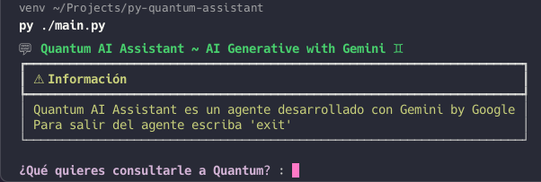

# Quantum AI Assistant

_Choose Life_



## Descripción
Este script Python es para ejecutar en tu terminal un chat directamente con Gemini, solo debes configurar 2 variables de entorno.

### Requisitos

* Python 3.x

### Configurar variables de entorno

Para configurar las variables de entorno, debe de crearse el archivo `.env` con los siguientes valores:

```python
# Para obtener tu API KEY de Gemini, debes ingresar en: https://g.co/ai/idxGetGeminiKey
GEMINI_API_KEY = [YOUR_GEMINI_API_KEY] 
# Para ver los modelos disponibles, debes ingresar en:  https://ai.google.dev/gemini-api/docs/models/gemini
GEMINI_MODEL = [YOUR_DESIRED_GEMINI_MODEL]
```

### Cómo ejecutar el script

1. Asegúrate de tener Python instalado en tu sistema.
2. Descarga este repositorio con `git clone` o como gustes.
3. Abre una terminal o línea de comandos.
4. Navega hasta la ubicación del archivo `main.py`.
5. Genera un nuevo entorno virtual con `python -m venv [NOMBRE_DEL_ENTORNO_VIRTUAL]`.`
6. Activa el entorno virtual con `source ./[NOMBRE_DEL_ENTORNO_VIRTUAL]/bin/activate` en Linux o en Windows con `[NOMBRE_DEL_ENTORNO_VIRTUAL]\Scripts\activate.bat` si usas cmd o `[NOMBRE_DEL_ENTORNO_VIRTUAL]\Scripts\activate.ps1` si usas Powershell
7. Instala las dependencias del proyecto con `pip install -r requirements.txt`
8. Ejecuta el script con el comando `python .py`.


### Licencia

**GNU GENERAL PUBLIC LICENSE**

### Contribuciones

Las contribuciones son bienvenidas. Puedes contribuir al proyecto haciendo un fork del repositorio, realizando cambios y enviando un Pull Request.
